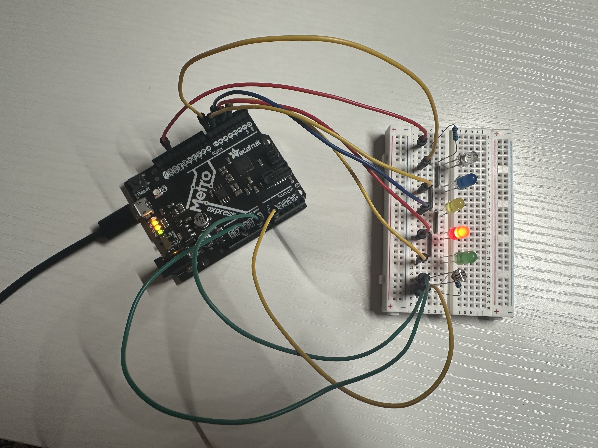

# MoodLight – AI Emotion-Aware Study Lamp

Detects the user's facial emotion via webcam and reflects it through
color-coded LEDs controlled by an Adafruit Metro M0 Express (CircuitPython).

## Problem
Students often become frustrated, stressed, or mentally fatigued while
studying without realizing it.

## Solution
MoodLight uses AI facial emotion recognition (DeepFace) to detect the
user's emotional state through a webcam, then reflects it through a
physical LED array connected to a Metro M0 Express board — giving
immediate visual feedback to help the user become more aware of their
emotional state while studying.

## Architecture

Laptop
  -> OpenCV (webcam capture)
  -> DeepFace (emotion detection)
  -> Debounce logic (stabilizes rapid emotion flickers)
  -> pyserial (USB serial)
  -> Metro M0 Express (CircuitPython)
  -> LEDs

## Emotion → LED Mapping
| Emotion  | LED Color |
|----------|-----------|
| Happy    | Yellow    |
| Disgust  | Blue      |
| Angry    | Red       |
| Surprise | Green     |
| Neutral (also covers sad/fear) | Clear/White |

## Hardware
- Adafruit Metro M0 Express
- 5 LEDs (yellow / blue / red / green / clear) + resistor(330-ohm)
- Breadboard, jumper wires

## Hardware
- Adafruit Metro M0 Express
- 5 LEDs (yellow / blue / red / green / clear) + resistor
- Breadboard, jumper wires

## Project Structure

MoodLight/
- computer_side/
  - moodlight_main.py — main app: camera + AI + LED integration
  - led_controller.py — serial communication with the M0
  - emotion_detector.py — standalone emotion detection test
- m0_side/
  - code.py — CircuitPython script running on the M0
- .gitignore
- README.md

## Setup
1. Flash `m0_side/code.py` onto the Metro M0 Express as `code.py`
2. Create a Python virtual environment (Python 3.11 recommended —
   TensorFlow does not yet support newer versions):
   - `python3.11 -m venv venv`
   - `source venv/bin/activate`
   - `pip install pyserial opencv-python deepface tf-keras`
3. Update `SERIAL_PORT` in `computer_side/moodlight_main.py` to match
   your M0's serial port
4. Run: `python computer_side/moodlight_main.py`

## Team / Author
UC San Diego SIPP Hackathon Team Wolves--- Tommie Liang
